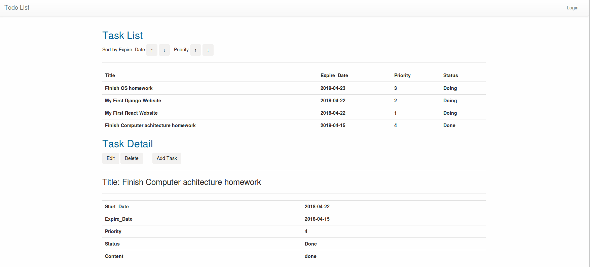

# Todo list
### 前言

尽管最后超过期限，可能无缘实习。但是在这一周的快速学习过程中，整个走了一遍从前端到后端的开发流程，大致了解了数据从前端到后端的传递过程，也学习到了Django的MTV开发模式和restful的概念，同时接触到了webpack构建工具以及前端和后端框架。同时，在一周的快速学习中，我也发现我的很多不足，总是追求完美，想把这些东西都学懂再去上手，实际上后面阅读别人的开源代码结合视频来学习，更容易上手。总结就是：一场失败但是富有收获的体验。

### 效果展示



### 安装说明

```shell
$cd frontend
$npm install
$npm start
```

